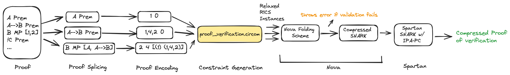

# Verifying Mathematical Proofs with Nova

Efficiently verifying mathematical proofs and computation has been a heavily researched topic within Computer Science. Particularly, as proofs become larger, even repetitive statements become much more complex on the prover side and inefficient for verifiers. To solve this problem, we can view this problem through the lens of the Incrementally Verifiable Computation (IVC) and utilize the novel Nova folding scheme that can combine multiple instances into a single folded instance. This repository provides the code of the implementation of a novel pipeline that utilizes this high-speed recursive SNARK, Nova, to develop a scheme with linear prover time, constant verifying capability, dynamic/easy modification, and privacy to efficiently validate mathematical proofs. 

## Methodology
To achieve such a feat using Nova for mathematical proofs we utilized the following pipeline described in the methodology below. Particularly, the mathematical proofs were first validated for formatting. Then the proof was sliced into independent sections: each with the statements, logic rules, and previous lines that were utilized. Third, the mathematical proof slices were converted in linear constraints based on a proof circuit. Utilizing a multiplexing approach, each instance calculated the necessary sums for all logic rules before conducting the necessary checks as indicated by the logic rule signal. Lastly, each of these linear instances were folded utilizing Nova and converted into a "recursive SNARK". To provide further proof compression, this SNARK was then utilized to form another smaller SNARK using the Spartan SNARK proof system. A diagram is found below: 


## Repository Design
A basic test can be run by simply running ``` cargo run``` which runs the [main.rs](src/main.rs) file. This program first preprocesses the inputted proof and encodes it numerically by slicing the proof with self-contained sections. Some sample proofs are included [here](misc/proof_tests). Note that every line of the proof must have the following format: 
```statement (logic, [reasoningline_#1, reasoningline_#2])```. In particular, the only logical operators that should be utilized should be part of the statement and are !(not), &(and),|(or),and > (arrow). 

Then, the necessary private and public inputs of each proof slice are hashed and submitted to the Nova-SNARK. The circuit in turn calculated check-sums on the proof slices based on the predicate logic and the lines used for proof reasoning that were both passed into the circuit as private inputs. These check-sums were systems of linear equations that were calculated on the encoded statement and lines of reasoning to be compared to the expected sums. The Circom circuit that was used can be found in [proof_verification](circuits/proof_verification). The main Circom file used is [proof_analysis.circom](circuits/proof_verification/proof_analysis.circom). 

The resulting R1CS instance is converted to a Nova friendly relaxed R1CS instance with Nova-Scotia. All the resulting relaxed proof slices instances are then inputted into the Nova SNARK and folded into a single instance that is then used in a recursive SNARK. Afterwards, this is also inputted into a Spartan proof system for an even more compressed proof.

## References
These projects/references were instrumental in helping to create this project
<ul>
  <li>https://github.com/microsoft/Nova/tree0fb0b495f224c555b5b221bd65ea9fbf43384c39</li>
  <li>https://github.com/nalinbhardwaj/Nova-Scotia</li>
  <li>https://github.com/lyronctk/zator/tree/main?tab=readme-ov-file</li>
</ul>
